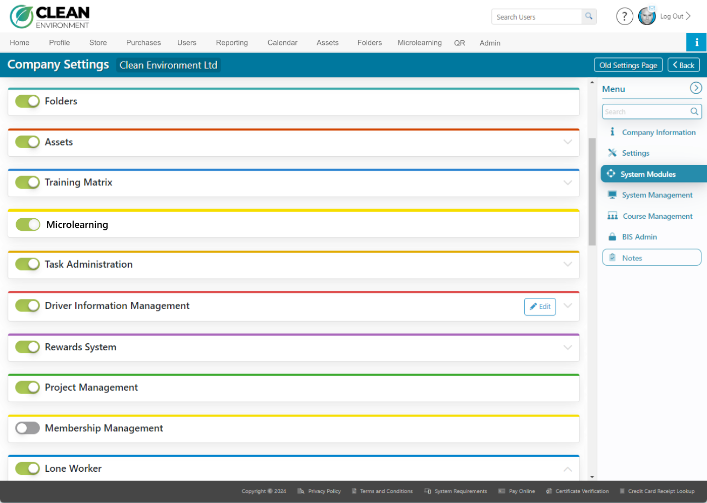

# Admin · 01 — Settings & Access

**Figma:** [Settings and Access section](https://www.figma.com/design/FcuknQmnPO3mOmlSAnIcmy/8716-Micro-Learning?node-id=97-1494) · node `97:1494`
**Doc ref:** Version 2 spec — "Admin View › Setup Module"
**Scope authority:** Team2-Microlearning-Scope-and-Plan.md §2.1
**Hackathon scope:** 🟢 Core (Setup toggle + module tile)

*Snapshot Jul 13 2026 · Figma is the source of truth — frame links below.*

## Purpose
Turn Microlearning **on** in Setup and expose it: the toggle in System Modules reveals the end-user **Microlearning tab** and the **Microlearning module tile** on the Admin page (the entry into the Dashboard).

## Data / entities
| Field | Type / constraint | Notes |
|---|---|---|
| `microlearningEnabled` | bool, per portal | toggled in Setup > System Modules; the Setup toggle row |

## Access matrix (who can do what)
| Role | Toggle Microlearning (Setup) | Open the Admin module |
|---|---|---|
| Senior Client Admin | ✅ | ✅ |
| Client Security Admin | ✅ | ✅ |
| Client Admin | ✅ | ✅ |
| Course Admin | ❌ *(see open Q)* | ✅ |

When ON: the **Microlearning tab** appears in the end-user portal menu **and** the **module tile** appears on the Admin page. When OFF: both hidden.

> Note: for the hackathon, **learner access is granted via topic permissions — By User / By Company Role** (see Topic Settings docs), **not** via per-user profile assignment. The Edit User Profile microlearning section is **out of scope** (see below).

## Frames in this section (manifest)
| # | State / variant | Figma | Scope |
|---|---|---|---|
| 01.a | Company Setting — Setup toggle | [node 78-2236](https://www.figma.com/design/FcuknQmnPO3mOmlSAnIcmy/8716-Micro-Learning?node-id=78-2236) | 🟢 |
| 01.b | Module Access — Admin-page tile | [node 78-2264](https://www.figma.com/design/FcuknQmnPO3mOmlSAnIcmy/8716-Micro-Learning?node-id=78-2264) | 🟢 |

---

## 01.a — Company Setting (Setup toggle) · [node 78-2236](https://www.figma.com/design/FcuknQmnPO3mOmlSAnIcmy/8716-Micro-Learning?node-id=78-2236)

- Path: **Admin > Setup > System Modules**.
- **Microlearning toggle** row placed **directly below the Training Matrix section** — standard Switch, label "Microlearning". Lives in the existing System Modules list; no new page chrome.
- **Who can toggle:** Senior Client Admin, Client Security Admin, Client Admin (see access matrix).
- Turning ON exposes the end-user tab + the Admin module tile (01.b).

## 01.b — Module Access (Admin-page tile) · [node 78-2264](https://www.figma.com/design/FcuknQmnPO3mOmlSAnIcmy/8716-Micro-Learning?node-id=78-2264)

- On the Admin landing grid, a **new Microlearning tile** (graduation-cap icon + "Microlearning" label), styled to match the other module cards.
- **Visible only when** the Setup toggle is ON. **Access:** the four roles above (incl. Course Admin).
- Clicking the tile opens the Microlearning admin module → **Dashboard** (`02 - Dashboard`).

## Component reuse (map to design system)
> Reuse existing components — confirm exact DS names before coding.
- **Switch / toggle** — same control as other System Modules rows.
- **Module tile card** — existing Admin-page tile pattern.

## Doc ↔ design notes / open questions
**Resolved**
- ✅ **Course Admin asymmetry** — confirmed intended per the spec: Course Admin **cannot toggle** Microlearning in Setup, but **can access** the Microlearning module from Admin once it's enabled. For the demo (hardcoded role gating), treat Course Admin as **module-access-only**, not setup-control.

## Out of hackathon scope
- 🔴 **Edit User Profile → Microlearning section** + per-user activities/progress modal (`93:2337` / `93:2664`) — learner access comes from topic permissions (By User / By Company Role), not profile assignment.
- 🔴 **Purge credentials** (hidden modal variant).
- Role-based permission enforcement for the toggle + tile (demo can hardcode "on").
