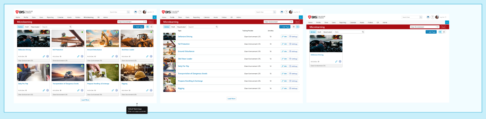

# Admin · 02 — Microlearning Dashboard

**Figma:** [Microlearning Dashboard section](https://www.figma.com/design/FcuknQmnPO3mOmlSAnIcmy/8716-Micro-Learning?node-id=182-28447) · node `182:28447`
**Doc ref:** Version 2 spec — "Admin View › Microlearning Dashboard" & "Create New Microlearning Topics"
**Scope authority:** Team2-Microlearning-Scope-and-Plan.md §2.2–2.3
**Hackathon scope:** 🟢 Core (grid/list cards, pillbox, search, Add Topic, empty state, Draft + Deactivated views, image crop) · 🔴 Non-goals: AI, push-to-subportals, network/public

*Snapshot Jul 13 2026 · Figma is the source of truth — frame links below.*

## Purpose
The admin landing page for the Microlearning module: lists topics for the selected portal as cards (grid + list), filterable by status, with search and the entry point to create a topic. Reached from the Microlearning tile on the Admin page (`01 - Settings`).

## Data / entities
> Field constraints are load-bearing (validation + copy).

**Topic**
| Field | Type / constraint | Notes |
|---|---|---|
| `id` | uuid | |
| `title` | string, **≤ 150**, required | show char count; empty → "Please enter a title." |
| `description` | string, **≤ 500 char**, required | collapsible; shown admin + learner |
| `image` | JPG/PNG, **< 4 MB**, rec **100×60px** | **default image if none**; upload + crop committed |
| `status` | enum `Active` \| `Draft` \| `Deactivated` | **defaults to `Active`** on create |
| `trainingProvider` | string (derived) | the portal's own name |
| `activityCount` | int (derived) | shown on card/row |
| `language` | portal-language default + additional languages | **multi-language supported** (re-added); per-language Title/Description, auto-translate |

**Enums** — Status: `Active` `Draft` `Deactivated` · StatusMarker: `Green=Active` `Grey=Draft` `Red=Deactivated`.

## Status transitions
| Status | Marker | Visible to users | Editable | Effect on events | Card clickable | Scope |
|---|---|---|---|---|---|---|
| **Active** | 🟢 Green | Yes | Yes | Events run | Yes | 🟢 |
| **Draft** | ⚪ Grey | No | Yes | Pauses active events | Yes (to edit) | 🟢 |
| **Deactivated** | 🔴 Red | No | No | Cancels events | No (no hover) | 🟢 |

## Frames in this section (manifest)
| # | State / variant | Figma | Scope |
|---|---|---|---|
| 02.a | Active — grid + list | [node 160-26613](https://www.figma.com/design/FcuknQmnPO3mOmlSAnIcmy/8716-Micro-Learning?node-id=160-26613) | 🟢 |
| 02.b | Draft | [node 285-23846](https://www.figma.com/design/FcuknQmnPO3mOmlSAnIcmy/8716-Micro-Learning?node-id=285-23846) | 🟢 |
| 02.c | Deactivated | [node 160-26614](https://www.figma.com/design/FcuknQmnPO3mOmlSAnIcmy/8716-Micro-Learning?node-id=160-26614) | 🟢 |
| 02.d | Empty states | [node 1160-119009](https://www.figma.com/design/FcuknQmnPO3mOmlSAnIcmy/8716-Micro-Learning?node-id=1160-119009) | 🟢 |
| 02.e | Add Topic modal | [node 160-26615](https://www.figma.com/design/FcuknQmnPO3mOmlSAnIcmy/8716-Micro-Learning?node-id=160-26615) | 🟢 |

---

## 02.a — Active view · [node 160-26613](https://www.figma.com/design/FcuknQmnPO3mOmlSAnIcmy/8716-Micro-Learning?node-id=160-26613) · 🟢

**Layout**
- **Header bar** — red "Microlearning" title · **Company drop-down** (e.g. "Clean Environment") · **Back** (→ Admin page).
- **Status pillbox** `Active · Draft · Deactivated` · **Search** field · **Grid / List** toggle · **(+) Add Topic**.
- **Grid card** (whole card clickable, hover effect): image · topic name · `Activities: {n}` · **status marker** (upper-right dot) · training provider · **Edit** (pencil) + **Settings** (gear).
- **List row** columns: Topic · Training Provider · Activities · Edit · Settings.
- Default topic image when none uploaded.

**Behaviour**
- **Search** matches topic name, activity name, or topic description, **scoped to the selected pill**; `(x)` clears; no match → "No topics found."
- **Card is clickable** — Active cards have a hover state; clicking opens the **Topic Details** page (same as the Edit icon).
- **Icon actions + tooltips (in scope):** Pencil = **Edit Topic** (→ Topic Details) · Gear/Cog = **Topic Settings**. Both show a hover tooltip.

## 02.b — Draft view · [node 285-23846](https://www.figma.com/design/FcuknQmnPO3mOmlSAnIcmy/8716-Micro-Learning?node-id=285-23846) · 🟢

- Same layout as Active with a **grey status marker**; topics still clickable, Edit + Settings available (Draft is editable). Draft **pauses** active events and hides topics from learners.

## 02.c — Deactivated view · [node 160-26614](https://www.figma.com/design/FcuknQmnPO3mOmlSAnIcmy/8716-Micro-Learning?node-id=160-26614) · 🟢

- **Red status marker**; cards **not clickable** (no hover). Actions per topic: **Reactivate** · **Purge** (topic-level purge modal [node 160-26612](https://www.figma.com/design/FcuknQmnPO3mOmlSAnIcmy/8716-Micro-Learning?node-id=160-26612) — permanent; purge-code required). List adds **Deactivated Date** + **Deactivated By** columns. *(Purge re-added per Mika; see `03-3` for the content-level purge pattern.)*

## 02.d — Empty states · [node 1160-119009](https://www.figma.com/design/FcuknQmnPO3mOmlSAnIcmy/8716-Micro-Learning?node-id=1160-119009) · 🟢

- **No topics (Welcome)** — graduation-cap icon: *"Welcome to your Microlearning module! You can create and deliver bite-sized, engaging training to your users. Click (+) Add Topic to get started."*
- **No search results** — magnifying-glass icon: *"No topics found."*

## 02.e — Add Topic · [node 160-26615](https://www.figma.com/design/FcuknQmnPO3mOmlSAnIcmy/8716-Micro-Learning?node-id=160-26615) · 🟢

- **(+) Add Topic** opens the **Add Microlearning Topic** form directly. *(No AI option — anything AI is out of scope.)*
- **Add Microlearning Topic** form:
  - **Title\*** — placeholder "Text", ≤ 150, char count; empty → "Please enter a title."
  - **Language** (multi-language, re-added) — **default chip = {Portal Language}**; check additional languages (e.g. French, Russian, Spanish, Portuguese). Checking one opens a **Language Versions** panel to enter **Title + Description per language**, with **auto-translate** ("Uses default language" → Add). See Add-Topic frame [node 160-26615](https://www.figma.com/design/FcuknQmnPO3mOmlSAnIcmy/8716-Micro-Learning?node-id=160-26615).
  - **Image** — JPG/PNG < 4 MB, rec 100×60px. **No image → default image.** The **Crop & Upload** modal is committed.
  - **Description\*** — placeholder "Type description", ≤ 500 char, collapsible.
  - **Buttons:** Cancel (→ dashboard) · **Add** (→ Topic Details page). New topic → **Status = Active**.

## Component reuse (map to design system)
> Reuse existing components — confirm exact DS names before coding.
- **Segmented pillbox** (status filter + Grid/List toggle) · **Topic card** · **data table/list row** · **Modal** shell (Add Topic) · **Company dropdown** · **status dot** · **icon buttons**.

## Doc ↔ design notes / open questions
**Resolved**
- ✅ Draft marker = grey · "Offline" (doc) = Draft · icon hover tooltips in scope · "Launched" = later screen.

_No open questions._

## Out of hackathon scope
- 🔴 **Anything AI** — Generate Using AI button (no greyed/"Coming soon" either), AI topic/activity generation.
- 🔴 **"Launched" / push to subportals**, network/public topics.

**Now in scope (was stretch):** image upload + crop modal · Draft status · Deactivate / Reactivate — all committed.
