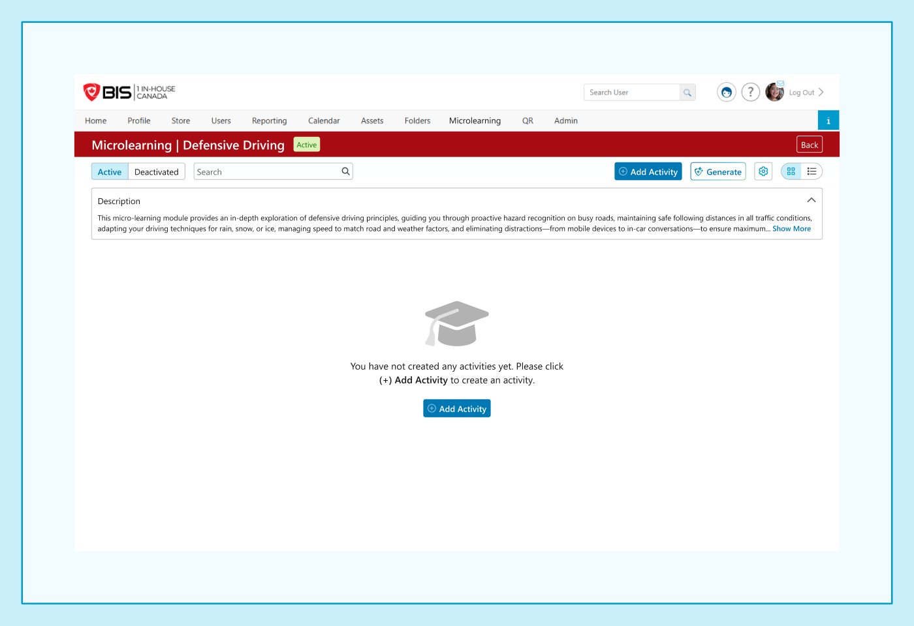

# Admin · 03-1 — Topic Content Page (New / Empty + Add Content)

**Figma:** [Topic Content Page section](https://www.figma.com/design/FcuknQmnPO3mOmlSAnIcmy/8716-Micro-Learning?node-id=182-28443) · node `182:28443`
**Doc ref:** Version 2 spec — "Topic Details Page" + "Create New Topic Activities"
**Scope authority:** Team2-Microlearning-Scope-and-Plan.md §2.4–2.6
**Hackathon scope:** 🟢 Core (empty state + Add Content: Link / PDF / Video (URL + MP4) / SCORM) · 🟢 Multi-language · 🔴 Out (Generate/AI only)

> **Terminology:** we call these **Content** items (not "Activities") for our scope. The Figma frames + spec still say "Activity" — treat as the same thing; labels to be updated.

*Snapshot Jul 13 2026 · Figma is the source of truth — frame links below.*

## Purpose
The page an admin lands on after creating a topic (`02 - Dashboard` → Add). Shows the topic's content items; when empty, prompts to add the first one. **Add Content** opens a modal to create a Link, PDF, Video (URL or MP4), or SCORM item.

## Data / entities
**Content item**
| Field | Type / constraint | Notes |
|---|---|---|
| `title` | string, **required, ≤ 50 char** | counter "0/50"; empty → "Please enter a title." |
| `image` | JPG/PNG, **< 4 MB** | **default image if none** |
| `type` | enum **`Video` (URL + MP4) · `Link` · `PDF` · `SCORM "Activity"`** | all committed |
| `url` | string | Video = YouTube/Vimeo URL; Link = allowed web URL (see dev note) |
| `file` | PDF | for PDF type |
| `lastUpdated` | date | shown on the content card |
| `status` | `Active` \| `Deactivated` | Active on create (see `03-2` / `03-3`) |
| `languageVersions` | per-language **Title / Description / Source** | multi-language (re-added); default = portal language; auto-translate |

## Frames in this section (manifest)
| # | State / variant | Figma | Scope |
|---|---|---|---|
| a | Empty state — new topic, no content | [node 160-26616](https://www.figma.com/design/FcuknQmnPO3mOmlSAnIcmy/8716-Micro-Learning?node-id=160-26616) | 🟢 |
| b | Add Content modal — type chooser | [node 450-36305](https://www.figma.com/design/FcuknQmnPO3mOmlSAnIcmy/8716-Micro-Learning?node-id=450-36305) | 🟢 |
| c | Type: **Video** (URL + MP4) | [node 875-36737](https://www.figma.com/design/FcuknQmnPO3mOmlSAnIcmy/8716-Micro-Learning?node-id=875-36737) · (MP4 variant [113-16759](https://www.figma.com/design/FcuknQmnPO3mOmlSAnIcmy/8716-Micro-Learning?node-id=113-16759)) | 🟢 |
| d | Type: **Link** | [node 113-17015](https://www.figma.com/design/FcuknQmnPO3mOmlSAnIcmy/8716-Micro-Learning?node-id=113-17015) | 🟢 |
| e | Type: **PDF** | [node 140-17743](https://www.figma.com/design/FcuknQmnPO3mOmlSAnIcmy/8716-Micro-Learning?node-id=140-17743) | 🟢 |
| f | Type: **Activity (SCORM zip)** | [node 140-17527](https://www.figma.com/design/FcuknQmnPO3mOmlSAnIcmy/8716-Micro-Learning?node-id=140-17527) | 🟢 |
| g | Success modal (all types) | [node 450-36541](https://www.figma.com/design/FcuknQmnPO3mOmlSAnIcmy/8716-Micro-Learning?node-id=450-36541) | 🟢 |

---

## a — Empty state · [node 160-26616](https://www.figma.com/design/FcuknQmnPO3mOmlSAnIcmy/8716-Micro-Learning?node-id=160-26616) · 🟢
- **Header bar:** `Microlearning | {TopicName}` + **status badge** (green "Active") + **Back**.
- **Controls row:** `Active · Deactivated` pillbox · **Search** · **(+) Add Content** (primary) · ~~Generate~~ (🔴 remove) · **settings** gear · **Grid/List** toggle.
- **Description** panel — collapsible (chevron), text + **Show More**.
- **Empty state (center):** graduation-cap icon + *"You have not created any activities yet. Please click (+) Add Content to create content."* + **(+) Add Content** button.
- Clicking **Add Content** → the Add Content modal (b).

## b — Add Content modal (type chooser) · [node 450-36305](https://www.figma.com/design/FcuknQmnPO3mOmlSAnIcmy/8716-Micro-Learning?node-id=450-36305) · 🟢
- Header: **(+) New Content** + close (×).
- **Title\*** — placeholder text, **0/50** char counter; empty → "Please enter a title."
- **Image** — filename field + **Select File**; helper *"Images must be JPG or PNG format and less than 4 MB. Recommended…"*; **default image if none**.
- **Type\*** — dropdown "Select Type" → **Video · Link · PDF · Activity (SCORM)**. Choosing a type reveals its fields (c–f).
- **Language** (multi-language, re-added) — default = **{Portal Language}**; check additional languages. A **Language Versions** panel adds per-language **Title / Description / Source** with **auto-translate** ("Uses default language" → Add). Frames: [node 160-26617](https://www.figma.com/design/FcuknQmnPO3mOmlSAnIcmy/8716-Micro-Learning?node-id=160-26617).
- Buttons: **Cancel** · **Add**.

## c — Video type (URL + MP4) · [node 875-36737](https://www.figma.com/design/FcuknQmnPO3mOmlSAnIcmy/8716-Micro-Learning?node-id=875-36737) · 🟢
- Committed: **Video = a URL** (YouTube or Vimeo) **or an uploaded MP4** ([113-16759](https://www.figma.com/design/FcuknQmnPO3mOmlSAnIcmy/8716-Micro-Learning?node-id=113-16759)). The modal offers URL **or** file upload.
- 🟢 **Language versions** — a separate video **URL / file** can be set per language.

## d — Link type · [node 113-17015](https://www.figma.com/design/FcuknQmnPO3mOmlSAnIcmy/8716-Micro-Learning?node-id=113-17015) · 🟢
- Adds a **URL** field (e.g. `https://www.safety.com`), with clear (×). Cancel · **Add**.
- **Dev note:** the system can only render some URLs in-software — **devs should define the allowed-URL list / restrictions**. **Fallback = open the link in a new browser tab.**

## e — PDF type · [node 140-17743](https://www.figma.com/design/FcuknQmnPO3mOmlSAnIcmy/8716-Micro-Learning?node-id=140-17743) · 🟢
- **Upload a PDF** (just a PDF for now). Same Title/Image/Add pattern.

## f — Activity type (SCORM zip) · [node 140-17527](https://www.figma.com/design/FcuknQmnPO3mOmlSAnIcmy/8716-Micro-Learning?node-id=140-17527) · 🟢
- **Upload a SCORM package** (.zip). Same Title/Image/Add pattern.
- Completion is driven by the **SCORM runtime** (not open-to-complete) — see End User `02 - Topic Page` completion logic.

## g — Success modal · [node 450-36541](https://www.figma.com/design/FcuknQmnPO3mOmlSAnIcmy/8716-Micro-Learning?node-id=450-36541) · 🟢
- Green check + **"New Content Created Successfully!"** (Figma: "New Activity…").
- Copy: *"A new activity was added to {TopicName} successfully! Any user with access to this topic can view this activity."* + **Close**.
- ⚠️ The Figma copy continues *"…added automatically to any scheduled microlearning events"* — **events are out of scope**; trim that sentence.

## Component reuse (map to design system)
- Topic header + **status badge** · **Active/Deactivated pillbox** · **Search** · **Grid/List toggle** · collapsible **Description** + Show More.
- **Modal** shell · **Title field + char counter** · **image file field** · **Type dropdown** · **URL field** · **success modal**.

## Doc ↔ design notes / open questions
**Resolved**
- ✅ **Generate/AI button removed** — AI is the only content-creation cut. **SCORM "Activity" type + MP4 upload are now in scope** (Video = URL **or** MP4). **Multi-language in scope.**

**Resolved**
- ✅ **Terminology** — Admin uses **Content**; the **End User side stays "Activities"** (learner-facing label unchanged).

**Open (to resolve with Mika)**
- ⚠️ **Allowed-URL restrictions** — devs to define which URLs render in-software vs open in a new tab (from the Link dev note).

## Out of hackathon scope
- 🔴 **Generate / AI** content creation.
- 🔴 Scheduled-**events** wording in the success modal — trim it (the events *scheduler* is out; learner notifications themselves are in scope).
