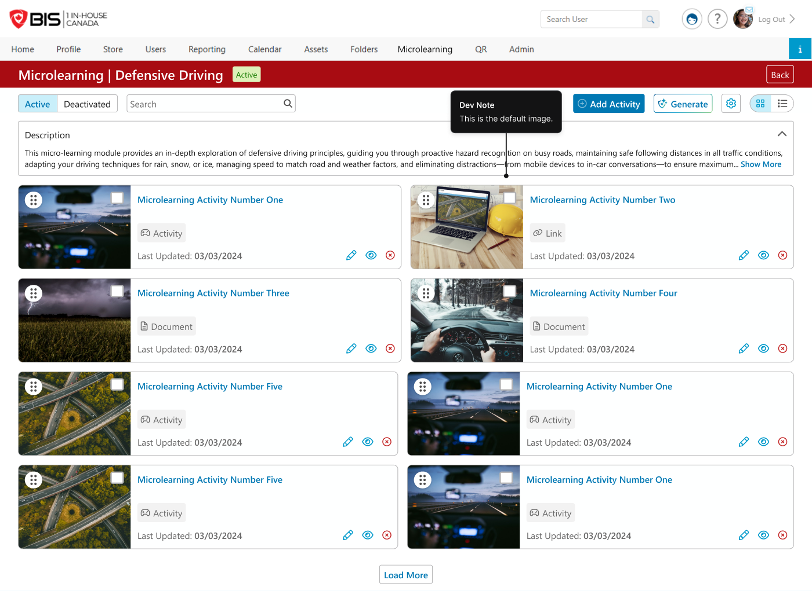

# Admin · 03-2 — Topic Content Page (Active view + Edit Content)

**Figma:** [Topic Content — Active section](https://www.figma.com/design/FcuknQmnPO3mOmlSAnIcmy/8716-Micro-Learning?node-id=160-26618) · node `160:26618`
**Doc ref:** Version 2 spec — "Topic Details Page" + "Edit Activity"
**Scope authority:** Team2-Microlearning-Scope-and-Plan.md §2.4–2.6
**Hackathon scope:** 🟢 Core (content list grid/list, open + edit, drag-reorder, deactivate, bulk-select, MP4 + SCORM) · 🟢 Multi-language · 🔴 Out (Generate/AI only)

> **Terminology:** **Content** = the item (Figma/spec say "Activity").

*Snapshot Jul 13 2026 · Figma is the source of truth — frame links below.*

## Purpose
The Topic Content Page once it has content: each item shown as a card (grid) or row (list), openable to **edit**. Covers the active list, its card/row anatomy + actions, and the **Edit Content** modal (incl. the edit-only **Complete Again** toggle).

## Data / entities (delta from `03-1`)
| Field | Type / constraint | Notes |
|---|---|---|
| `status` | `Active` \| `Deactivated` | this file = Active tab |
| `order` | derived | items sorted **alphabetically**; drag-reorder committed |
| `lastUpdated` | date | shown on card/row |
| `completeAgain` | bool | **edit-only** toggle; forces re-completion, keeps latest record |

## Frames in this section (manifest)
| # | State / variant | Figma | Scope |
|---|---|---|---|
| a | Active — grid, single card | [node 140-17934](https://www.figma.com/design/FcuknQmnPO3mOmlSAnIcmy/8716-Micro-Learning?node-id=140-17934) | 🟢 |
| b | Active — grid, filled | [node 147-18300](https://www.figma.com/design/FcuknQmnPO3mOmlSAnIcmy/8716-Micro-Learning?node-id=147-18300) | 🟢 |
| c | Active — **list view** | [node 147-19395](https://www.figma.com/design/FcuknQmnPO3mOmlSAnIcmy/8716-Micro-Learning?node-id=147-19395) | 🟢 |
| prev | **Preview** (eye) → learner viewer | [node 452-41752](https://www.figma.com/design/FcuknQmnPO3mOmlSAnIcmy/8716-Micro-Learning?node-id=452-41752) · [viewer 1160-116458](https://www.figma.com/design/FcuknQmnPO3mOmlSAnIcmy/8716-Micro-Learning?node-id=1160-116458) | 🟢 |
| edit | **Edit Content** modal | [node 966-58171](https://www.figma.com/design/FcuknQmnPO3mOmlSAnIcmy/8716-Micro-Learning?node-id=966-58171) | 🟢 |
| ok-1 | Success — Complete Again **checked** | [node 966-62147](https://www.figma.com/design/FcuknQmnPO3mOmlSAnIcmy/8716-Micro-Learning?node-id=966-62147) | 🟢 |
| ok-2 | Success — Complete Again **unchecked** | [node 966-62113](https://www.figma.com/design/FcuknQmnPO3mOmlSAnIcmy/8716-Micro-Learning?node-id=966-62113) | 🟢 |

---

## a / b — Active view (grid) · [node 140-17934](https://www.figma.com/design/FcuknQmnPO3mOmlSAnIcmy/8716-Micro-Learning?node-id=140-17934) · [filled 147-18300](https://www.figma.com/design/FcuknQmnPO3mOmlSAnIcmy/8716-Micro-Learning?node-id=147-18300) · 🟢
- Same page chrome as `03-1` (header + status badge, `Active/Deactivated` pillbox, Search, **Add Content**, ~~Generate~~ 🔴, settings gear, Grid/List toggle, collapsible Description).
- **Content card:** thumbnail · **name** (blue link) · **type chip** (Link / PDF / Video) · **Last Updated: {date}** · action icons **Edit (pencil) · Preview (eye) · Deactivate (red ×)**.
  - 🟢 **6-dot drag handle** (top-left) = drag-to-reorder.
  - 🟢 **Checkbox** (top-right) = bulk-select (see `03-3`).
- **Whole card is clickable → opens Edit** (same as the pencil).
- New content is inserted **alphabetically** among existing items.
- **Action hover tooltips (dev note, in scope):** Pencil = *Edit Content* · Eye = *Preview Content* · × = *Deactivate Content*.

## c — Active view (list) · [node 147-19395](https://www.figma.com/design/FcuknQmnPO3mOmlSAnIcmy/8716-Micro-Learning?node-id=147-19395) · 🟢
- Columns: [drag handle 🟢] · [checkbox 🟢] · thumbnail · **Topic** (name link) · **Type** · **Last Updated** · **Edit** · **View** · **Deactivate**.
- Header has a select-all checkbox (🟢 bulk). **Load More** at the bottom.

## prev — Preview content · [node 452-41752](https://www.figma.com/design/FcuknQmnPO3mOmlSAnIcmy/8716-Micro-Learning?node-id=452-41752) · [viewer 1160-116458](https://www.figma.com/design/FcuknQmnPO3mOmlSAnIcmy/8716-Micro-Learning?node-id=1160-116458) · 🟢
- Clicking the **eye (Preview)** icon opens the content in the **same viewer the learner sees** — an overlay/modal with a dark header (`{ContentName}` + topic chip + close ×) over the content page.
- Reuses the learner **Link / PDF / Video-URL viewers** — see **End User `02 - Topic Page`** (don't re-spec them here).
- ⚠️ **Preview must NOT record completion** (admin is previewing, not consuming). Dev/QA: ensure the preview path skips completion tracking.

## edit — Edit Content modal · [node 966-58171](https://www.figma.com/design/FcuknQmnPO3mOmlSAnIcmy/8716-Micro-Learning?node-id=966-58171) · 🟢
- Header: ✏️ **Edit Content** + close (×). Opens from the card/pencil.
- Same fields as create (`03-1`): **Title\*** (0/50) · **Image** (JPG/PNG < 4 MB, default) · **Type\*** · type-specific field.
  - For **Video**: **Source = Video URL or uploaded MP4** (Upload File toggle, MP4 < 80 MB) — both committed.
- 🟢 **Language Versions** — **Manage language versions** opens a table of configured languages (e.g. Français ✓, Español "Uses default language" → Add) with per-language **Title / Source**, plus **auto-translate**. Default = portal language.
- **Complete Again** toggle — **appears only in edit mode**. Copy: *"Users who already completed this content must complete this content again. Note: Record of their latest completion will remain."*
- **Close** / save.

## ok-1 / ok-2 — Success modals · [checked 966-62147](https://www.figma.com/design/FcuknQmnPO3mOmlSAnIcmy/8716-Micro-Learning?node-id=966-62147) · [unchecked 966-62113](https://www.figma.com/design/FcuknQmnPO3mOmlSAnIcmy/8716-Micro-Learning?node-id=966-62113) · 🟢
- Green check confirmation on save. Two variants:
  - **Complete Again UNCHECKED** — content updated; existing completions preserved.
  - **Complete Again CHECKED** — content updated **and** users who already completed it must complete it again (latest record retained).
- Exact copy per Figma; **Close** dismisses.

## Component reuse (map to design system)
- Reuses `03-1` chrome + modal. Adds: **content card** (drag handle, thumbnail, type chip, last-updated, icon actions) · **list row** · **Complete Again toggle** · **success modal** variants.

## Doc ↔ design notes / open questions
**Resolved**
- ✅ Whole card opens Edit · new content inserted **alphabetically** · action **hover tooltips** in scope (Edit/Preview/Deactivate) · **Video = URL or MP4** · **SCORM in scope** · **bulk-select + drag-reorder in scope** · **multi-language in scope** · **Generate/AI removed** (only cut).

_No open questions._

## Out of hackathon scope
- 🔴 **Generate / AI** content creation — the only cut here.

**Now in scope (was cut/stretch):** bulk-select (checkboxes + select-all + action bar) · MP4 upload · SCORM "Activity" type · drag-to-reorder · Deactivate flow — all committed (see `03-3`).
