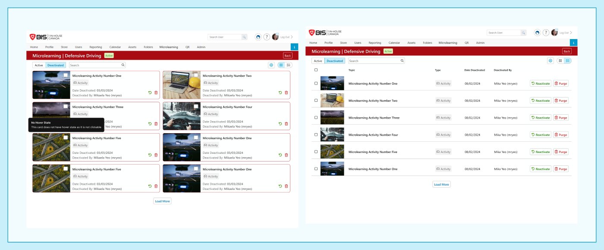

# Admin · 03-3 — Topic Content Page (Deactivate · Reactivate · Purge · Bulk)

**Figma:** [Deactivated content section](https://www.figma.com/design/FcuknQmnPO3mOmlSAnIcmy/8716-Micro-Learning?node-id=160-26619) · node `160:26619`
**Doc ref:** Version 2 spec — "Deactivating / Reactivating Activities" + "Purge Activities"
**Scope authority:** Team2-Microlearning-Scope-and-Plan.md §3–4 (superseded — all of this is now committed)
**Hackathon scope:** 🟢 Deactivate / Reactivate · 🟢 Purge · 🟢 Bulk-select — all committed

> **Terminology:** **Content** = the item (Figma/spec say "Activity").
> **Scope note:** the original Team2 plan listed Purge and Bulk-select as non-goals. Both — plus Deactivate / Reactivate — are now **in scope** per Mika.

*Snapshot Jul 13 2026 · Figma is the source of truth — frame links below.*

## Purpose
Managing content once it's turned off: the **Deactivated** tab, the single-item and **bulk** actions (Deactivate / Reactivate / Purge), and their confirmation modals.

## Data / entities (delta)
| Field | Type / constraint | Notes |
|---|---|---|
| `status` | `Active` \| `Deactivated` | this file = Deactivated tab + the transitions |
| `deactivatedDate` | date | shown on deactivated card/row |
| `deactivatedBy` | user | shown on deactivated card/row |
| `purged` | terminal | permanent delete — removes all completion records |

## State transitions
| From → To | Trigger | Effect |
|---|---|---|
| Active → Deactivated | Deactivate (× icon / bulk) + confirm | users lose access; content moves to Deactivated tab |
| Deactivated → Active | Reactivate (↺ icon / bulk) + confirm | users regain access |
| Deactivated → *gone* | Purge (🗑 icon / bulk) + purge code | **permanent**; all completion records deleted |

## Frames in this section (manifest)
| # | State / variant | Figma | Scope |
|---|---|---|---|
| a | Deactivated — grid | [node 160-26619](https://www.figma.com/design/FcuknQmnPO3mOmlSAnIcmy/8716-Micro-Learning?node-id=160-26619) · [alt 396-31793](https://www.figma.com/design/FcuknQmnPO3mOmlSAnIcmy/8716-Micro-Learning?node-id=396-31793) | 🟢 |
| b | Deactivated — list | [node 160-24702](https://www.figma.com/design/FcuknQmnPO3mOmlSAnIcmy/8716-Micro-Learning?node-id=160-24702) | 🟢 |
| c | Bulk bar — Active (Deactivate) | [node 285-25148](https://www.figma.com/design/FcuknQmnPO3mOmlSAnIcmy/8716-Micro-Learning?node-id=285-25148) | 🟢 |
| d | Bulk bar — list | [node 285-25173](https://www.figma.com/design/FcuknQmnPO3mOmlSAnIcmy/8716-Micro-Learning?node-id=285-25173) | 🟢 |
| e | **Deactivate** modal | [node 182-29013](https://www.figma.com/design/FcuknQmnPO3mOmlSAnIcmy/8716-Micro-Learning?node-id=182-29013) | 🟢 |
| f | **Reactivate** modal | [node 966-64909](https://www.figma.com/design/FcuknQmnPO3mOmlSAnIcmy/8716-Micro-Learning?node-id=966-64909) | 🟢 |
| g | **Purge** modal | [node 966-65298](https://www.figma.com/design/FcuknQmnPO3mOmlSAnIcmy/8716-Micro-Learning?node-id=966-65298) | 🟢 |

---

## a / b — Deactivated view (grid + list) · [node 160-26619](https://www.figma.com/design/FcuknQmnPO3mOmlSAnIcmy/8716-Micro-Learning?node-id=160-26619) · [list 160-24702](https://www.figma.com/design/FcuknQmnPO3mOmlSAnIcmy/8716-Micro-Learning?node-id=160-24702) · 🟢
- Same page chrome, **Deactivated** pill active. No Add Content / Generate on this tab; Search + settings + Grid/List toggle remain.
- **Deactivated card:** red-outlined, thumbnail · name · type chip · **Date Deactivated: {date}** · **Deactivated By: {user}** · per-item **Reactivate (↺)** + **Purge (🗑)** icons · checkbox (🟢 bulk).
- **List** adds Date Deactivated / Deactivated By columns.

## c / d — Bulk action bar · [node 285-25148](https://www.figma.com/design/FcuknQmnPO3mOmlSAnIcmy/8716-Micro-Learning?node-id=285-25148) · [list 285-25173](https://www.figma.com/design/FcuknQmnPO3mOmlSAnIcmy/8716-Micro-Learning?node-id=285-25173) · 🟢
- Selecting card checkboxes shows a **bottom action bar**: "**{n} items selected**".
  - On **Active** tab → **Cancel · Deactivate**.
  - On **Deactivated** tab → **Cancel · Purge · Reactivate**.
- 🟢 Bulk-select is in scope, alongside the single-item icon actions.

## e — Deactivate modal · [node 182-29013](https://www.figma.com/design/FcuknQmnPO3mOmlSAnIcmy/8716-Micro-Learning?node-id=182-29013) · 🟢
- 🚫 **Deactivate Content** + close. Copy: *"If you deactivate this content, users can no longer access it. Are you sure you want to deactivate…?"* (bulk = bullet list of items). Buttons: **Cancel · Deactivate** (red).
- ⚠️ Figma copy references being *"removed from scheduled events"* — **events are out of scope**; trim.

## f — Reactivate modal · [node 966-64909](https://www.figma.com/design/FcuknQmnPO3mOmlSAnIcmy/8716-Micro-Learning?node-id=966-64909) · 🟢
- ↺ **Reactivate Content** + close. Copy: *"If you reactivate these content items, users will be able to access them again. Are you sure you want to reactivate…?"* + bullet list. Buttons: **Cancel · Reactivate** (green).

## g — Purge modal · [node 966-65298](https://www.figma.com/design/FcuknQmnPO3mOmlSAnIcmy/8716-Micro-Learning?node-id=966-65298) · 🟢
- 🗑 **Purge Content** + close. Copy: *"Purging these content items will remove all historical records of completion for this content. Please enter the purge code if you are sure you want to permanently delete these content items."*
- **Bullet list** of the selected items + **Purge Code** field. Buttons: **Cancel · Purge** (red).
- **Permanent** — no undo; deletes all completion records.

## Component reuse (map to design system)
- Reuses `03-2` card/list + chrome. Adds: **deactivated card** (date/by + reactivate/purge icons) · **bulk action bar** · **Deactivate / Reactivate / Purge** confirmation modals · **purge-code field**.

## Doc ↔ design notes / open questions
**Resolved**
- ✅ **Deactivate / Reactivate / Purge and Bulk-select are all committed** (supersedes the original Team2 non-goals).
- ✅ Deactivated cards show **Date Deactivated + Deactivated By** and per-item **Reactivate / Purge**.
- ✅ Bulk bar actions: Active = Deactivate; Deactivated = Purge + Reactivate.

_No open questions._

## Out of hackathon scope
- 🔴 Scheduled-**events** wording in the Deactivate modal — trim it (events *scheduler* is out; notifications themselves are in).
- Scheduled **events** wording in the Deactivate modal.
