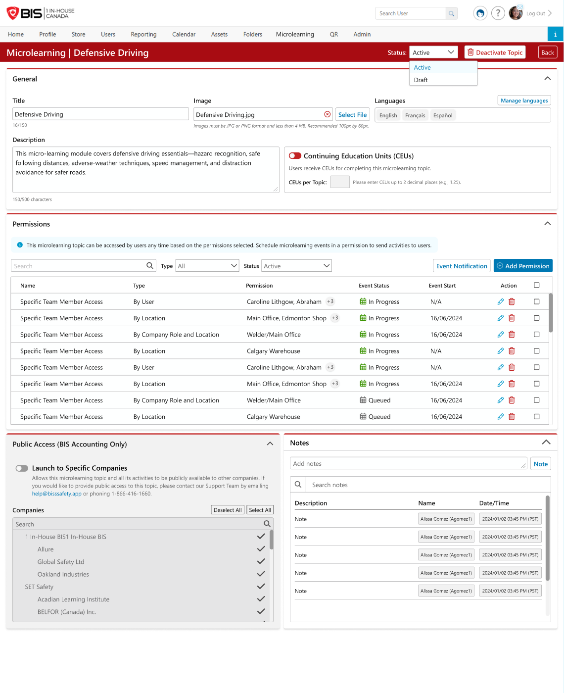

# Admin · 04 — Topic Settings

**Figma:** [Topic Settings section](https://www.figma.com/design/FcuknQmnPO3mOmlSAnIcmy/8716-Micro-Learning?node-id=1214-119108) · node `1214:119108`
**Doc ref:** Version 2 spec — "Microlearning Topic Settings"
**Scope authority:** Team2-Microlearning-Scope-and-Plan.md §2.7 (permissions now a real feature — By User / By Company Role)
**Hackathon scope:** 🟢 General (title/image/languages/description), Status/Draft/Deactivate, Manage Languages, Notes, **Permissions (By User + By Company Role)** · 🔴 By Location, Event scheduler, CEUs, Public Access

> **Permissions are in scope:** the **Permissions** section is built with **By User** and **By Company Role** (Add Permission UI). 🔴 **By Location**, the **Event scheduler**, CEUs and Public Access stay out. Learner notifications (email/SMS) are in scope; the *scheduling engine* that would drive them is not.
> **Terminology:** **Content** = the item (Figma/spec say "Activity").

*Snapshot Jul 13 2026 · Figma is the source of truth — frame links below.*

## Purpose
The config page for a topic (opened from the Dashboard/Topic Content **Settings** gear). Edit the topic's metadata, status, language versions, **permissions (By User / By Company Role)**, and deactivate it. The Event scheduler that used to live here is out of scope.

## Data / entities (topic settings)
| Field | Type / constraint | Notes |
|---|---|---|
| `title` | string, **≤ 150** | topic title limit = **150** (confirmed) |
| `image` | JPG/PNG, < 4 MB, rec 100×60 | Select File / clear |
| `description` | string, **≤ 500** | "150/500 characters" |
| `status` | `Active` \| `Draft` (→ `Deactivated` via button) | dropdown top-right; Draft committed |
| `languageVersions` | per-language **Title (≤50) / Description (≤300)** | Manage Languages; Translate (auto) + Delete |
| `notes` | audit note list | committed (§3 #5) |
| `permissions` | **By User · By Company Role** | Add Permission UI; 🔴 By Location out |

## Frames in this section (manifest)
| # | State / variant | Figma | Scope |
|---|---|---|---|
| a | Settings — default/empty | [node 457-36299](https://www.figma.com/design/FcuknQmnPO3mOmlSAnIcmy/8716-Micro-Learning?node-id=457-36299) | 🟢 |
| b | Settings — filled | [node 203-8943](https://www.figma.com/design/FcuknQmnPO3mOmlSAnIcmy/8716-Micro-Learning?node-id=203-8943) | 🟢 |
| c | **Manage Languages** modal | [node 919-107226](https://www.figma.com/design/FcuknQmnPO3mOmlSAnIcmy/8716-Micro-Learning?node-id=919-107226) | 🟢 |
| d | **Remove language** (delete) | [node 961-40460](https://www.figma.com/design/FcuknQmnPO3mOmlSAnIcmy/8716-Micro-Learning?node-id=961-40460) | 🟢 |
| ~~e~~ | ~~Event Notification (scheduler)~~ | [node 211-42126](https://www.figma.com/design/FcuknQmnPO3mOmlSAnIcmy/8716-Micro-Learning?node-id=211-42126) | 🔴 out |
| f | **Deactivate Topic** modal | [node 611-33010](https://www.figma.com/design/FcuknQmnPO3mOmlSAnIcmy/8716-Micro-Learning?node-id=611-33010) | 🟢 |

---

## a / b — Settings page · [empty 457-36299](https://www.figma.com/design/FcuknQmnPO3mOmlSAnIcmy/8716-Micro-Learning?node-id=457-36299) · [filled 203-8943](https://www.figma.com/design/FcuknQmnPO3mOmlSAnIcmy/8716-Micro-Learning?node-id=203-8943) · 🟢
- **Header:** `Microlearning | {TopicName}` · **Status** dropdown (Active / Draft) · **Deactivate Topic** button · **Back**.
- **General** section (collapsible):
  - **Title** (see char-limit ⚠️) · **Image** (JPG/PNG < 4 MB, rec 100×60, Select File / clear).
  - **Languages** — chips (e.g. English · Français · Español) + **Manage languages** button (c).
  - **Description** (≤ 500, char count).
  - 🔴 **Continuing Education Units (CEUs)** toggle + "CEUs per Topic" — **out of scope**.

## c / d — Manage Languages · [modal 919-107226](https://www.figma.com/design/FcuknQmnPO3mOmlSAnIcmy/8716-Micro-Learning?node-id=919-107226) · [remove 961-40460](https://www.figma.com/design/FcuknQmnPO3mOmlSAnIcmy/8716-Micro-Learning?node-id=961-40460) · 🟢 (multi-language)
- **Manage Languages** modal: one card per added language (e.g. Français, Español), each with **Title\*** (≤50) · **Description\*** (≤300) · **Translate** (auto-translate) · **Delete**. **Close** to finish.
- **Remove language (d):** deleting a language removes its version (confirm before delete).

## e — Permissions · 🟢 (By User + By Company Role)
- **Permissions** section with **Add Permission** → grant a topic to **specific users** or a **company role**. Shows granted permissions in a list; remove to revoke.
- 🔴 **By Location** permission type is out; **By User** and **By Company Role** cover the demo.

## f — Deactivate Topic modal · [node 611-33010](https://www.figma.com/design/FcuknQmnPO3mOmlSAnIcmy/8716-Micro-Learning?node-id=611-33010) · 🟢
- 🚫 **Deactivate {TopicName}** + close. Copy: *"If you deactivate this microlearning topic, it will no longer be available to users in your portal… Are you sure you want to deactivate this topic?"* Buttons: **Cancel · Deactivate** (red).
- ⚠️ Figma copy references *"scheduled events or events in progress will be cancelled"* — the **events scheduler is out of scope**; trim that clause.

## Component reuse (map to design system)
- Topic header + **status dropdown** · collapsible **section panels** · **Title/Image/Description** fields · **Manage Languages** modal (per-language cards + Translate/Delete) · **Deactivate** confirm modal · **Notes** list (if built).

## Doc ↔ design notes / open questions
**Resolved**
- ✅ **Permissions are in scope** — By User + By Company Role (Add Permission UI). By Location is out.
- ✅ **Notes / audit trail, Deactivate, and Draft status are all committed.**
- ✅ Multi-language kept here (Manage Languages).

- ✅ **Topic title limit = 150** (confirmed) — Add-Topic modal updated to match.

## Out of hackathon scope
- 🔴 **By Location** permission type — By User + By Company Role cover the demo.
- 🔴 **Event Notification scheduler** + the frequency/cadence **events** engine ([node 211-42126](https://www.figma.com/design/FcuknQmnPO3mOmlSAnIcmy/8716-Micro-Learning?node-id=211-42126)). *(Learner notifications themselves are in scope — see End User `04 - Misc`.)*
- 🔴 **CEUs** (Continuing Education Units).
- 🔴 **Public Access** — Launch to Specific Companies (BIS Accounting), network topics.
