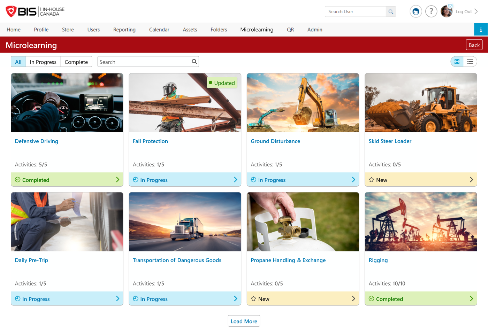

# End User · 01 — Topic Home (Microlearning module landing)

**Figma:** [Topic Home section](https://www.figma.com/design/FcuknQmnPO3mOmlSAnIcmy/8716-Micro-Learning?node-id=284-21362) · node `284:21362`
**Doc ref:** Version 2 spec — "End User View › Microlearning Homepage"
**Scope authority:** Team2-Microlearning-Scope-and-Plan.md §2.8
**Hackathon scope:** 🟢 Core (homepage list, New/In Progress/Completed, All/In Progress/Complete filter, search)

*Snapshot Jul 13 2026 · Figma is the source of truth — frame links below.*

## Purpose
The landing screen a learner sees after clicking **Microlearning** in the portal menu. Lists every topic they have permission to access, with progress at a glance; the entry point into each topic.

## Data / entities
> The topic as the learner sees it. Progress is derived from content item completion.

| Field | Type / constraint | Notes |
|---|---|---|
| `topicName` | string | Card title; links to Topic Page (02). |
| `image` | JPG/PNG | Card thumbnail; default image if none set. |
| `completedCount` / `totalCount` | int / int | **Grid** shows `X/Y`; **List** shows only the **total** (e.g. "10"). |
| `status` | enum | Derived: see enums. |
| `updated` | bool flag | Additive badge; set when admin changes a topic the learner already engaged with. |

**Enums** — `status`: `New` · `In Progress` · `Completed`. Plus an `Updated` overlay flag.

## Status transitions
| Status | Marker | When | Card clickable |
|---|---|---|---|
| New | 🟡 yellow, ☆ star icon | 0 of Y content items complete | Yes → Topic Page |
| In Progress | 🔵 blue, ◷ clock icon | 1…Y-1 complete | Yes |
| Completed | 🟢 green, ✓ check icon | Y of Y complete | Yes (review) |
| **Updated** (overlay) | 🟢 green "● Updated" pill, top-right of image | Admin added a content item, or edited a completed content item with **Complete Again** | Yes — a Completed topic moves **back to In Progress** |

## Frames in this section (manifest)
| # | State / variant | Figma |
|---|---|---|
| 01.a | Empty (no topics yet) | [node 14-8563](https://www.figma.com/design/FcuknQmnPO3mOmlSAnIcmy/8716-Micro-Learning?node-id=14-8563) |
| 01.b | Grid — **All** filter | [node 8-978](https://www.figma.com/design/FcuknQmnPO3mOmlSAnIcmy/8716-Micro-Learning?node-id=8-978) |
| 01.c | Grid — **In Progress** filter | [node 58-1851](https://www.figma.com/design/FcuknQmnPO3mOmlSAnIcmy/8716-Micro-Learning?node-id=58-1851) |
| 01.d | Grid — **Complete** filter | [node 58-2125](https://www.figma.com/design/FcuknQmnPO3mOmlSAnIcmy/8716-Micro-Learning?node-id=58-2125) |
| 01.e | **List** view | [node 32-716](https://www.figma.com/design/FcuknQmnPO3mOmlSAnIcmy/8716-Micro-Learning?node-id=32-716) |

---

## 01.a — Empty state · [node 14-8563](https://www.figma.com/design/FcuknQmnPO3mOmlSAnIcmy/8716-Micro-Learning?node-id=14-8563)
- Graduation-cap illustration + **"Welcome to Microlearning!"** and "You have no microlearning topics currently available."
- Filter pills, search, and view toggle still render (all inert with no topics).

## 01.b — Grid, All filter · [node 8-978](https://www.figma.com/design/FcuknQmnPO3mOmlSAnIcmy/8716-Micro-Learning?node-id=8-978)
- **Header:** red "Microlearning" bar + **Back** (→ portal Home).
- **Filter pills:** `All · In Progress · Complete`. **Search** field. **Grid/List** toggle (top-right).
- **Card:** image, topic name (blue link), `Content: X/Y`, status footer pill with chevron. **Updated** = green pill on the image top-right.
- **Load More** at the bottom (pagination). Topics ordered **alphabetically**.

## 01.c — Grid, In Progress filter · [node 58-1851](https://www.figma.com/design/FcuknQmnPO3mOmlSAnIcmy/8716-Micro-Learning?node-id=58-1851)
- Shows **New *and* In Progress** topics together ✅ (confirmed — overrides the doc, which excluded New).

## 01.d — Grid, Complete filter · [node 58-2125](https://www.figma.com/design/FcuknQmnPO3mOmlSAnIcmy/8716-Micro-Learning?node-id=58-2125)
- Completed topics only.

## 01.e — List view · [node 32-716](https://www.figma.com/design/FcuknQmnPO3mOmlSAnIcmy/8716-Micro-Learning?node-id=32-716)
- Columns: **Topic** (thumbnail + name link, Updated badge inline) · **Status** (pill) · **Content** · chevron.
- **Content should show `X/Y`** (same as grid) ✅ — the current frame shows a total-only count and needs updating.
- Same filters/search/toggle as grid.

## Component reuse (map to design system)
> Confirm exact BIS DS component names before coding.
- Filter **pillbox** (`All/In Progress/Complete`) · **search** input · **grid/list** icon toggle.
- **Topic card** (image + title + meta + status footer) · **list table** row.
- **Status pill** (green/blue/yellow variants w/ icon) · **Updated badge** · **Load More** button.

## Doc ↔ design notes / open questions
**Resolved**
- ✅ **In Progress filter** shows **New + In Progress** together (overrides the doc's "In Progress excludes New").
- ✅ **List "Content" column** shows **`X/Y`**, same as grid (frame currently shows total-only → update needed).
- ✅ **Default sort = alphabetical.** Optional: add an alphabetical **sort control**.
- ✅ **Search — no results:** "No topics found." with a **❓ question-mark icon**.
- ✅ Empty-state copy matches doc exactly ("Welcome to Microlearning! You have no microlearning topics currently available.").
- ✅ Color coding: green = Completed, blue = In Progress, orange/yellow = New.

## Out of hackathon scope
- _Nothing cut on this screen._ The **mobile version of this landing is in scope** — see End User · 03 — Mobile.
