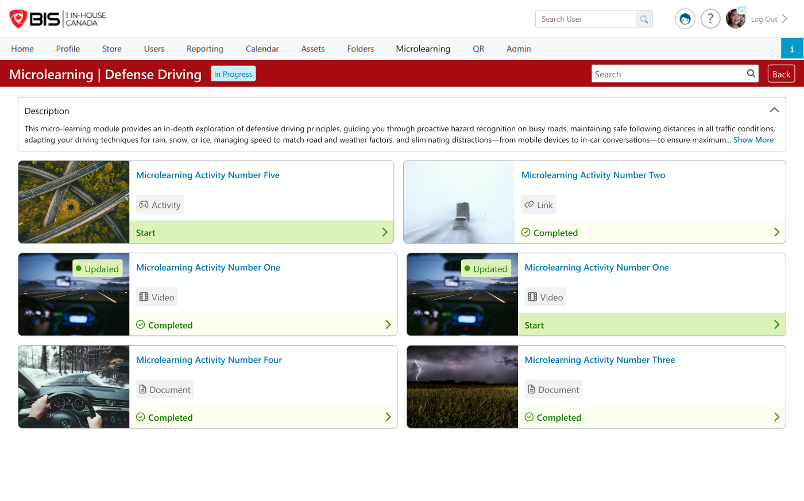

# End User · 02 — Topic Page (inside a topic)

**Figma:** [Topic Page section](https://www.figma.com/design/FcuknQmnPO3mOmlSAnIcmy/8716-Micro-Learning?node-id=284-23658) · node `284:23658`
**Doc ref:** Version 2 spec — "End User View › Microlearning Topic" + "Microlearning Content"
**Scope authority:** Team2-Microlearning-Scope-and-Plan.md §2.9–2.10
**Hackathon scope:** 🟢 Core learning loop — content item types **Link, PDF, Video (URL + MP4), and SCORM "Activity"** (all committed)

*Snapshot Jul 13 2026 · Figma is the source of truth — frame links below.*

## Purpose
What a learner sees inside a topic: the collapsible description + the list of content items to complete. Each content item opens in its own viewer. Completion is tracked per content item; finishing all content items completes the topic.

## Data / entities
| Field | Type / constraint | Notes |
|---|---|---|
| `content itemName` | string, 50 char | Card title; opens the viewer. |
| `type` | enum | **Link · PDF · Video (URL + MP4) · SCORM** (all committed). Each has a unique icon chip. |
| `image` | JPG/PNG | Card thumbnail; default if none. |
| `status` | enum | Start · Completed (+ `Updated` flag). |

**Enums** — `type` (committed): `Link` · `PDF` · `Video` (URL YouTube/Vimeo **or** uploaded MP4) · `SCORM "Activity"`. `status`: `Start` (not started) · `Completed`.

## Status transitions (per content item)
| Status | Meaning | Applies to | Completion trigger |
|---|---|---|---|
| Start | Not accessed yet, or completed then admin edited w/ **Complete Again** | all committed types | — |
| Completed | Done — **opening completes it** (SCORM completes via its runtime) | Link · PDF · Video · SCORM | see completion table |
| **Updated** | Admin changed the content item; badge **clears when opened** (no re-completion required) | all | — |

_(Committed content item types complete on open, so there's no per-content item "In Progress" — a **topic** is In Progress when some but not all content items are complete.)_

## Frames in this section (manifest)
| # | State / variant | Figma | Scope |
|---|---|---|---|
| 02.a | Topic — **Completed** | [node 14-9005](https://www.figma.com/design/FcuknQmnPO3mOmlSAnIcmy/8716-Micro-Learning?node-id=14-9005) | 🟢 |
| 02.b | Topic — **In Progress** | [node 14-9867](https://www.figma.com/design/FcuknQmnPO3mOmlSAnIcmy/8716-Micro-Learning?node-id=14-9867) | 🟢 |
| 02.c | Viewer — **Video URL** (YouTube/Vimeo) | [node 58-1365](https://www.figma.com/design/FcuknQmnPO3mOmlSAnIcmy/8716-Micro-Learning?node-id=58-1365) | 🟢 |
| 02.d | Viewer — **PDF** | [node 58-1366](https://www.figma.com/design/FcuknQmnPO3mOmlSAnIcmy/8716-Micro-Learning?node-id=58-1366) | 🟢 |
| 02.e | Viewer — **Link** | [node 58-1367](https://www.figma.com/design/FcuknQmnPO3mOmlSAnIcmy/8716-Micro-Learning?node-id=58-1367) | 🟢 |
| 02.f | Viewer — **Activity (SCORM)** | [node 58-1368](https://www.figma.com/design/FcuknQmnPO3mOmlSAnIcmy/8716-Micro-Learning?node-id=58-1368) | 🟢 |

---

## 02.a — Topic, Completed · [node 14-9005](https://www.figma.com/design/FcuknQmnPO3mOmlSAnIcmy/8716-Micro-Learning?node-id=14-9005)
- **Header:** `Microlearning | {TopicName}` + **status pill** + **Search** (by content item name) + **Back**.
- **Description** panel — collapsible (chevron), 2 lines by default + **Show More**.
- **Content cards** in a 2-column grid: image · name (blue link) · **type chip** (icon + label) · status footer pill + chevron. Whole card is clickable.
- Even when Completed, every content item stays openable for review.

## 02.b — Topic, In Progress · [node 14-9867](https://www.figma.com/design/FcuknQmnPO3mOmlSAnIcmy/8716-Micro-Learning?node-id=14-9867)
- Same layout; not-started content items surface a **Start** action; mixed statuses per card.

## 02.c — Video viewer (URL + MP4) · [node 58-1365](https://www.figma.com/design/FcuknQmnPO3mOmlSAnIcmy/8716-Micro-Learning?node-id=58-1365)
- **Committed:** **Video URL** (YouTube/Vimeo embed) **and uploaded MP4**, played **in-portal** with the player's controls. Blue header `{TopicName} | Microlearning Content`.

## 02.d — PDF viewer · [node 58-1366](https://www.figma.com/design/FcuknQmnPO3mOmlSAnIcmy/8716-Micro-Learning?node-id=58-1366)
- **Direction: render in an iframe inside a modal** over the topic page ✅ (Mika's decision).
- ⚠️ The current frame *depicts* a new browser tab — **frame to be updated** to the iframe-modal pattern.

## 02.e — Link viewer · [node 58-1367](https://www.figma.com/design/FcuknQmnPO3mOmlSAnIcmy/8716-Micro-Learning?node-id=58-1367)
- **Direction: render the web URL in an iframe inside a modal** ✅ (Mika's decision).
- ⚠️ The current frame *depicts* a new browser tab — **frame to be updated** to the iframe-modal pattern.

## 02.f — Activity / SCORM viewer · 🟢 · [node 58-1368](https://www.figma.com/design/FcuknQmnPO3mOmlSAnIcmy/8716-Micro-Learning?node-id=58-1368)
- SCORM ZIP "Activity" plays **in-portal** in the SCORM runtime. Completion is reported by the **SCORM package** (not open-to-complete) — the runtime's completion/passed status marks the content item complete.

### Completion logic (the core of the feature)
**Rule of thumb: opening a content item marks it complete — except SCORM, which reports its own completion.**

| Type | Viewer | Completion trigger | Trackable? |
|---|---|---|---|
| **PDF** | iframe in modal | **opening it** | ✅ at open |
| **Link** | iframe in modal | **opening it** | ✅ at open |
| **Video** (URL + MP4) | in-portal embed / player | **opening it** ✅ (decided — *not* full-watch) | ✅ at open |
| **SCORM** | in-portal runtime | **SCORM completion/passed status** | ✅ via runtime |

## Component reuse (map to design system)
- Topic header + **status pill** · collapsible **Description** + Show More · **Search** input.
- **Content card** (image + title + **type chip** + status footer) · type icon set (Link · PDF · Video · SCORM).
- **Video embed/player** (YouTube/Vimeo URL + MP4) · **iframe-in-modal** viewer (PDF + Link) · **SCORM runtime** · **Start** button.

## Doc ↔ design notes / open questions
**Resolved**
- ✅ **Document & Link render in an iframe inside a modal** (Mika's decision). The current frames depict a new browser tab and must be updated.
- ✅ **Completion = opening the content item** for Document, Link, and **Video** (video is *not* gated on full-watch). **SCORM reports its own completion** via the runtime.
- ✅ **Whole card is the click target** (broader than the doc's "name or progress bar") — go with design.
- ✅ **Search — no results:** "No content found." with a **❓ question-mark icon**.
- ✅ Video & SCORM play **in-portal** with a maximize/fullscreen control.
- ✅ Grid view only inside a topic; search is by content item name; description is collapsible (2 lines + Show More).

**Open (to resolve with dev)**
- ⚠️ **SCORM completion tracking** — confirm the runtime signal used to mark complete (completion vs passed status).

## Out of hackathon scope
- **SCORM, MP4 upload, and the mobile viewers are all now in scope** (mobile viewers → End User · 03 — Mobile).
- 🔴 Offline download of content items (spec says no offline at this time).
