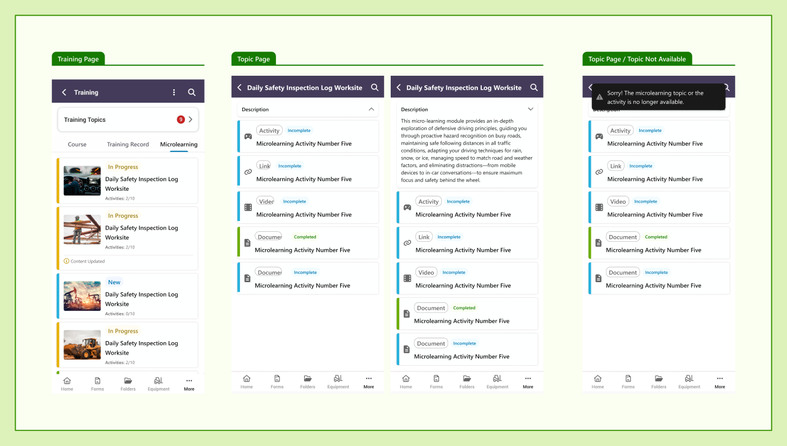

# End User · 03 — Mobile (SafeTapp)

**Figma:** [Mobile — Microlearning](https://www.figma.com/design/FcuknQmnPO3mOmlSAnIcmy/8716-Micro-Learning?node-id=1160-119006) · node `1160:119006`
**Doc ref:** Version 2 spec — "Mobile App"
**Scope authority:** Team2-Microlearning-Scope-and-Plan.md §4 (superseded — the mobile build is now in scope)
**Hackathon scope:** 🟢 In — **the full SafeTapp (React Native) mobile experience is committed:** browse topics + **open all content types in-app** (Link / PDF / Video / SCORM), completion synced.

*Snapshot Jul 13 2026 · Figma is the source of truth — frame links below.*

## Purpose
How learners access and complete microlearning topics on mobile (SafeTapp), surfaced inside the app's **Training** area.

## Data / entities
Same Topic/Content model as web, but mobile uses simpler labels:
- **Topic** status: `New` · `In Progress` · `Completed` (+ `Updated`).
- **Content** status: `Incomplete` · `Completed` (+ `Updated`).
- **Use "Updated" on both mobile and web** ✅ — the current mobile frame says "Content Updated" and should be changed to "Updated".

## Frames in this section (manifest)
One link covers the whole mobile section: [node 1160-119006](https://www.figma.com/design/FcuknQmnPO3mOmlSAnIcmy/8716-Micro-Learning?node-id=1160-119006). It contains three views (below).

## Layout & behaviour
**A. Training page — Microlearning tab**
- Microlearning is the **3rd tab** on the Training page (`Course · Training Record · Microlearning`).
- Topics as **list cards**: thumbnail, status label (In Progress / New), topic name, `Content: X/10`, and a left **color bar** by status. An **"⟳ Updated"** note appears when a content item changed (frame currently says "Content Updated" → change to "Updated").
- Bottom tab bar: Home · Forms · Folders · Equipment · More.

**B. Topic page**
- Purple header: back · `{TopicName}` · search.
- Collapsible **Description**.
- Content list cards: **type chip** (Link/Video/PDF) · status (`Incomplete` blue / `Completed` green) · name · left color bar.

**C. Topic / content item not available**
- Tapping a link to a deactivated/purged/decommissioned topic shows a **snackbar (toast)**: *"Sorry! The microlearning topic or the content item is no longer available."*

**D. Content viewer — orientation (per-type)** *(prototype addition)*
- The viewer opens **in-app**. Orientation depends on the content type, and the **whole UI reflows** to landscape (device widens, the dark viewer header stays on top, the player fills the wider area) — not just a rotated frame.

| Type | Opens in | Rotate button? |
|---|---|---|
| **Video** | **Landscape** (default) | ✅ can return to portrait |
| **SCORM** ("Activity") | **Landscape** (default) | ✅ can return to portrait |
| **Link** | **Portrait** (default) | ✅ button to rotate to landscape |
| **PDF** (Document) | **Portrait** — has its own document/scroll viewer | 🚫 no rotate button |

- **Rotate control icon:** Font Awesome **`mobile-rotate`** (`fa-mobile-rotate`, **Pro**). The web prototype renders it as an **inline SVG fallback** (a tilted phone + two rotation arrows) since it ships on the free CDN — dev to swap in the real Pro glyph.
- Rotation resets to the per-type default whenever the viewer is closed/reopened.

## Component reuse (map to design system)
- SafeTapp Training tab bar · list card · status chip/label · snackbar/toast · collapsible description.
- **In-app content viewer** (dark header + player) with a **`mobile-rotate`** (FA Pro) orientation toggle; landscape is a real layout reflow.
- (Mobile components live in SafeTapp Foundation, not the web DS.)

## Doc ↔ design notes / open questions
**Resolved**
- ✅ **Placement:** design puts Microlearning as the **3rd tab on the Training page** (supersedes the doc's "Quick Links + hamburger" — aligns with the "Training module in the app" direction).
- ✅ **Unavailable pattern is platform-specific:** mobile = **snackbar** (here); web = **modal** (see 04.a). Not a conflict.

- ✅ **Completion = opening** for video (same as web); **wording "Updated"** used on both mobile and web.

**Open (to resolve with dev / mobile trio)**
- ⚠️ **SCORM completion tracking** — same open question as web (see 02 — Topic Page); left to dev.

## Out of hackathon scope
- The full mobile build **is committed**, including **viewing all content types (Link / PDF / Video / SCORM) inside the app**.
- 🔴 Offline download of content items — spec says no offline functionality at this time.
