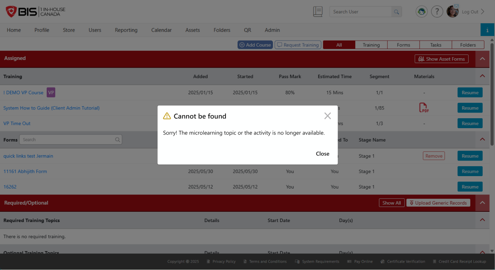

# End User · 04 — Misc (Kick-out modal · Notifications · Home-page entry)

**Figma:** [Misc section](https://www.figma.com/design/FcuknQmnPO3mOmlSAnIcmy/8716-Micro-Learning?node-id=1160-119008) · node `1160:119008`
**Doc ref:** Version 2 spec — "Deactivating Topics" · "Event Notifications" · "Microlearning Events" (user-account Training section)
**Scope authority:** Team2-Microlearning-Scope-and-Plan.md §3–4
**Hackathon scope:** 🟢 All three in scope — 04.a unavailable modal · 04.b Email + SMS notifications · 04.c Home-page entry (Training section). 🔴 Out: the Events *scheduler* (frequency/cadence + custom email editor).

*Snapshot Jul 13 2026 · Figma is the source of truth — frame links below.*

## Purpose
Three smaller end-user surfaces, all in scope: the **unavailable-topic modal**, **Email + SMS notifications**, and the **Home-page Training-section entry** (with an assigned / in-progress / completed section). Only the underlying Events *scheduler* (cadence/frequency) is out.

## Frames in this section (manifest)
| # | Item | Figma | Scope |
|---|---|---|---|
| 04.a | Warning modal — unavailable topic/content item (web) | [node 53-1014](https://www.figma.com/design/FcuknQmnPO3mOmlSAnIcmy/8716-Micro-Learning?node-id=53-1014) | 🟢 |
| 04.b | Notification — Email + SMS | [node 285-23659](https://www.figma.com/design/FcuknQmnPO3mOmlSAnIcmy/8716-Micro-Learning?node-id=285-23659) | 🟢 |
| 04.c | Home page — Microlearning in Training section | [node 561-38836](https://www.figma.com/design/FcuknQmnPO3mOmlSAnIcmy/8716-Micro-Learning?node-id=561-38836) | 🟢 |

---

## 04.a — Warning modal (web) · [node 53-1014](https://www.figma.com/design/FcuknQmnPO3mOmlSAnIcmy/8716-Micro-Learning?node-id=53-1014)
- **Trigger:** a learner taps an **content item link in an email or SMS** for a topic/content item that has been **deactivated, purged, or decommissioned**. They must **log in** first.
- **Result:** lands on their training/home page with a **modal**: header **"⚠️ Cannot be found"**, **Close** button.
- **Message copy — follow the spec doc (state-specific):**
  - Deactivated / **purged** / **decommissioned** → *"Sorry! The microlearning topic or the content item is no longer available."*
  - **Draft** topic → *"Sorry! This microlearning content item is temporarily unavailable. Please check back again later."*
- In-scope triggers here: **Deactivated**, **Purged**, **Decommissioned**, **Draft**. (Mobile shows a **snackbar** for the same case — see 03.C.)

## 04.b — Notifications (Email + SMS) · 🟢 · [node 285-23659](https://www.figma.com/design/FcuknQmnPO3mOmlSAnIcmy/8716-Micro-Learning?node-id=285-23659)
- **In scope.** Learners get **Email + SMS** notifications (topic assigned / updated / reminders). Copy/variables per the Version 2 spec.
- 🔴 The **Events scheduler** that would automate cadence/frequency (custom email editor) is out — notifications fire on assignment/update, not on a scheduling engine.

## 04.c — Home-page entry (Training section) · 🟢 · [node 561-38836](https://www.figma.com/design/FcuknQmnPO3mOmlSAnIcmy/8716-Micro-Learning?node-id=561-38836)
- **In scope.** A **Microlearning section on the portal home / Training area** surfacing **assigned · in-progress · completed** microlearning items, linking into each topic.

## Doc ↔ design notes / open questions
**Resolved**
- ✅ **Web = modal, mobile = snackbar** for unavailable topics/content items — platform-specific, not a conflict.
- ✅ **Unavailable copy — follow the spec doc:** "no longer available" (Deactivated); **separate "temporarily unavailable" message for Draft** topics.

_No open questions for this screen._

## Out of hackathon scope
- 🔴 The **Events scheduler** — frequency/cadence scheduling + custom email editor. *(The notifications themselves (04.b) and the home-page entry (04.c) are in scope; only the scheduler is not.)*
